# March Machine Learning Mania 2026

**How these Predictions were Determined**

For every possible matchup in the 2026 NCAA tournament — both men's and women's — I built machine learning models that predict the probability that one team beats another. For example, the model might say "Duke has a 74% chance of beating Oregon." The brackets on [aaron-england.com](https://aaron-england.com/march-madness) are the result of simulating the entire tournament using those predicted probabilities.

These models were built for Kaggle's [March Machine Learning Mania 2026](https://www.kaggle.com/competitions/march-machine-learning-mania-2026/overview) competition, where predictions are scored using the **Brier score** — a measure of how close your predicted probabilities are to what actually happened. A perfect prediction scores 0; a coin flip scores 0.25. Lower is better.

---

## Overview

| | Men's | Women's |
|---|---|---|
| **Training games** | 2,585 tournament matchups (1985-2025) | 1,717 tournament matchups (1998-2025) |
| **Features** | 74 difference features | 63 difference features |
| **Models** | XGBoost, PyTorch, Logistic Regression | CatBoost, PyTorch, Logistic Regression |
| **Kaggle validation (2022-2025)** | Brier: 0.1800 | Brier: 0.1244 |
| **Best single model** | PyTorch (Brier: 0.1760) | PyTorch (Brier: 0.1313) |
| **Final ensemble** | **Brier: 0.1747** | **Brier: 0.1299** |
| **Predictions generated** | 66,430 matchups | 65,703 matchups |

**Understanding the scores:** All three score rows — "Best single model," "Final ensemble," and "Kaggle validation" — come from the same honest testing process (Phase 2 below). For each historical season, the model trained on every *other* season and predicted that one without ever seeing it. "Best single model" and "Final ensemble" are those predictions scored across *all* historical tournaments (1985-2025 for men's, 1998-2025 for women's). "Kaggle validation" is the same set of predictions, just filtered to the 2022-2025 tournaments — the subset Kaggle uses to rank competitors before the real 2026 games. It's slightly different because 4 seasons is a smaller, noisier sample than 40.

---

## Every Major Design Decision Was Research-Backed

Every major design choice in this pipeline was informed by studying past winning Kaggle solutions and academic research:

| Decision | Why |
|----------|-----|
| Test on one season at a time | Standard approach in every top Kaggle solution — prevents "peeking" at future data |
| Show each matchup from both sides | Recommended by 2023 gold medal winner — prevents ordering bias |
| Use specific expert ranking systems | 2023 gold medal winner identified POM, SAG, MOR, WLK as the most predictive |
| Train neural net on Brier loss | Academic research showed this outperforms standard binary classification loss |
| Calibrate probabilities after training | Top 2025 Kaggle solution confirmed this consistently improves scores |
| Weight recent seasons more in blending | Modern basketball is most relevant to 2026 — a 2025 game counts 40x more than a 1985 game when finding blend weights |
| Cap predictions at 2%-98% | Universal practice — being 100% confident and wrong is catastrophically penalized |

---

## How the Models Were Built

Three different types of models were trained for each gender, then blended together. Think of it like asking three different experts for their opinion, then combining their answers — giving more weight to the experts who have been right most often in the past. Each model was built in three phases:

### Phase 1: Find the Best Settings

Every model has "knobs" you can turn — how fast it learns, how complex it can get, how aggressively it avoids memorizing noise, etc. To find the best combination of settings, an automated search (Optuna) tested 30-50 different configurations per model. For each configuration, it trained on 3 of the 4 most recent tournament seasons and predicted the 4th, rotating through all 4. The configuration that produced the best predictions was locked in for the next phases.

| Model | Trials | Tuning Folds | Best Trial Brier |
|-------|--------|-------------|-----------------|
| XGBoost (men's) | 50 | 2022-2025 | 0.1836 |
| PyTorch (men's) | 30 | 2022-2025 | 0.1861 |
| Logistic Regression (men's) | 50 | 2022-2025 | 0.1918 |
| CatBoost (women's) | 50 | 2022-2025 | 0.0874 |
| PyTorch (women's) | 30 | 2022-2025 | tuned |
| Logistic Regression (women's) | 50 | 2022-2025 | tuned |

### Phase 2: Test on Every Historical Season

With the settings locked in, each model was tested on **every historical tournament season one at a time**. For example, to see how well the model would have predicted the 2015 tournament, it trained on every other season (1985-2014, 2016-2025) and then predicted 2015 — never seeing 2015 data during training. This was repeated for all 40 men's seasons and 27 women's seasons, producing an honest prediction for every historical tournament game. These predictions were used to determine how much weight each model should get in the final blend.

After generating predictions, a calibration step was applied. If the model says "70% chance" but teams in that situation historically win 75% of the time, calibration corrects that drift — making the probabilities more accurate.

### Phase 3: Train the Final Model

Finally, each model was retrained on **all available historical data** — every tournament game ever played — to make the actual 2026 predictions. The more data a model sees, the better it can learn patterns, so this final version is the strongest. Predictions are calibrated using the isotonic regression model from Phase 2, then clipped to [0.02, 0.98].

### Blending the Models Together

The last step is combining the three models into a single prediction. An optimizer found the best blend by finding the weights that would have produced the most accurate predictions across all historical tournaments — but with a twist: **recent seasons count more**. A game from 2025 is weighted 40x more than a game from 1985, because modern basketball is most relevant to predicting 2026. For men's, the final blend is roughly 55% neural network + 45% XGBoost. For women's, it's 67% neural network + 33% CatBoost. In both cases, logistic regression received 0% weight — its predictions were too similar to the other models to add anything new.

```
Phase 1: Find best settings       →  locked configuration per model
              ↓
Phase 2: Test on every season     →  honest predictions → blend weights
              ↓
Phase 3: Train on ALL history     →  2026 predictions × blend weights → final bracket
```

---

## Pipeline Architecture

The pipeline runs in 8 stages, with separate men's and women's notebooks at each stage. All data flows through S3 on AWS SageMaker.

```
00_data_collection/     Raw Kaggle CSVs
        |
01_data_joining/        Merge & aggregate into parquet datasets
        |
02_eda/                 Exploratory analysis & visualizations
        |
03_data_split/          Tournament matchups + LOGO-CV fold assignments
        |
04_preprocessing/       Difference features + flip-and-double augmentation
        |
05_models/              3 models x LOGO-CV + Optuna tuning + isotonic calibration
   |  xgboost/            XGBoost (Optuna-tuned, custom Brier objective) — men's
   |  catboost/           CatBoost (Optuna-tuned, RMSE loss) — women's
   |  pytorch/            BrierNet (Optuna-tuned architecture, Brier loss) — both
   |  logistic_regression/ LogisticRegression (Optuna-tuned C/penalty) — both
        |
06_model_eval/          Compare models + optimize ensemble weights
        |
07_submission/          Combine men's + women's into final CSV
```

---

# Part 1: Men's Tournament

## Data

The men's dataset spans 41 seasons (1985-2026) with nearly 200,000 regular season games and 2,585 tournament games. A unique advantage for men's predictions: **Massey Ordinals** — pre-tournament rankings from ~192 different rating systems (KenPom, Sagarin, and many more) that provide expert opinions on team quality.

| Dataset | Rows | Seasons | Description |
|---------|------|---------|-------------|
| Regular season (compact) | 198,577 | 1985-2026 | Game scores and locations |
| Regular season (detailed) | 124,529 | 2003-2026 | Full box score statistics |
| Tournament (compact) | 2,585 | 1985-2025 | Tournament game scores |
| Tournament (detailed) | 1,449 | 2003-2025 | Tournament box scores |
| Massey Ordinals | 5,865,001 | 2003-2026 | Weekly rankings from ~192 systems |
| Tournament seeds | 2,694 | 1985-2026 | Seed assignments per team |

*Table 1: Men's data sources and their coverage.*

## Exploratory Data Analysis

### How Predictive Are Seeds?

A team's seed (their ranking in the bracket, 1 being the best) is by far the most useful piece of information for predicting tournament outcomes. 1-seeds win 79% of their tournament games, and 16-seeds have only beaten a 1-seed twice in men's history. But seeds alone aren't the whole story — that's where the other 73 features come in.

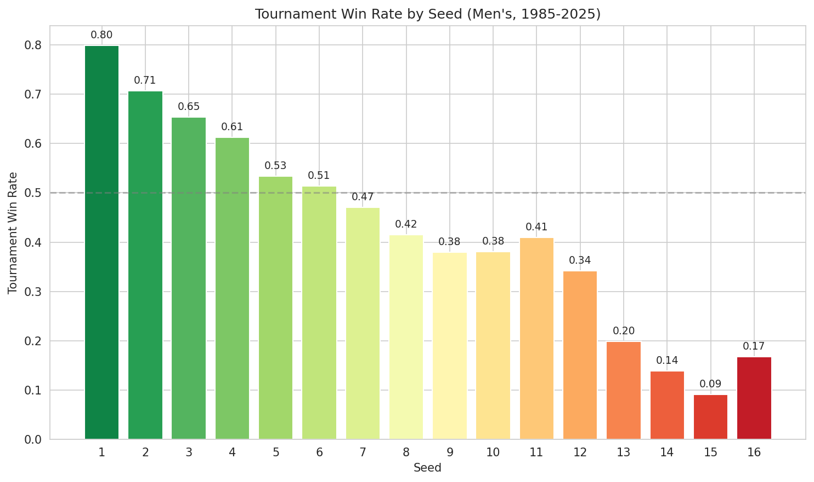
*Figure 1: Tournament win rate by seed number (Men's, 1985-2025). Higher seeds win significantly more often, though 8 vs 9 matchups are essentially coin flips (48.1%).*

| Matchup | Higher Seed Win Rate | Games |
|---------|---------------------|-------|
| #1 vs #16 | 98.8% | 160 |
| #2 vs #15 | 93.1% | 160 |
| #3 vs #14 | 85.6% | 160 |
| #4 vs #13 | 79.4% | 160 |
| #5 vs #12 | 64.4% | 160 |
| #6 vs #11 | 61.3% | 160 |
| #7 vs #10 | 61.0% | 159 |
| #8 vs #9 | 48.1% | 160 |

*Table 2: First-round matchup win rates for the higher-seeded team (Men's, 1985-2025).*

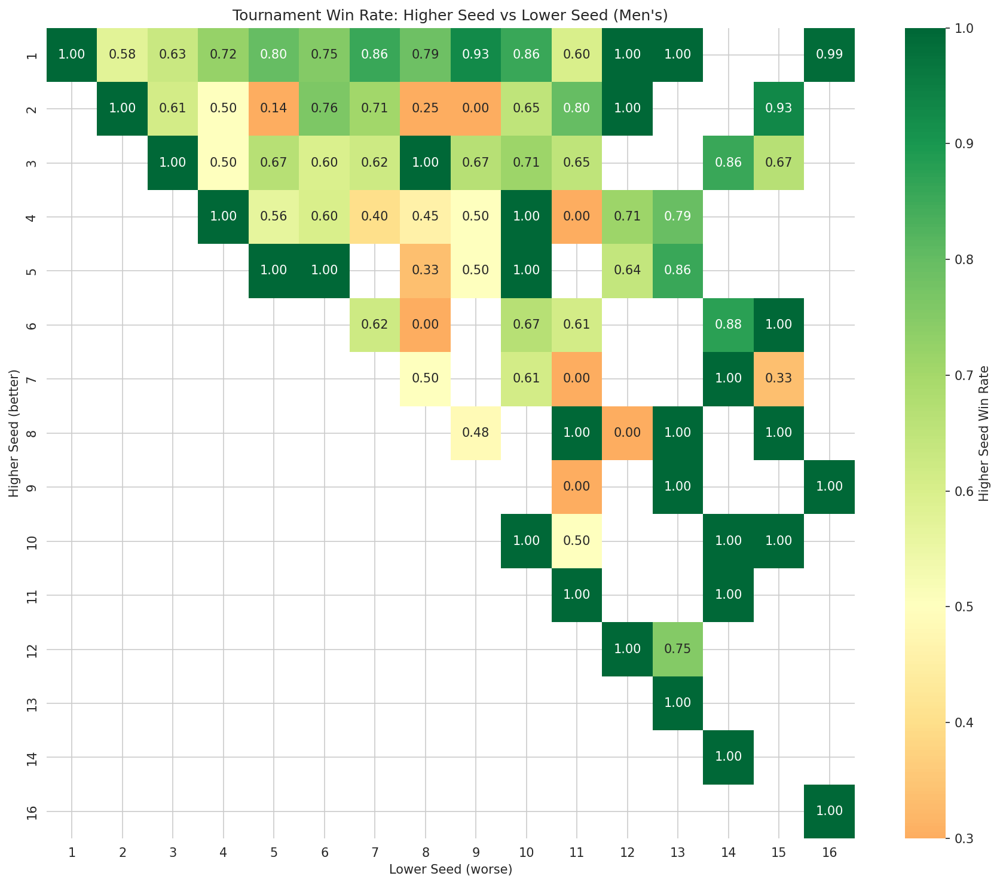
*Figure 2: Tournament win rate heatmap for all seed matchups (Men's). Closer seed matchups are harder to predict.*

### Upset Trends Over Time

The overall upset rate across the men's tournament is 27.3%. There is no strong trend over time.

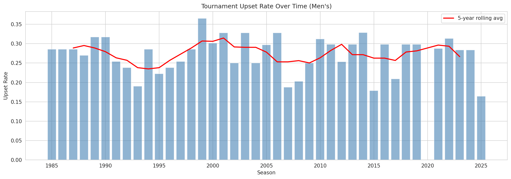
*Figure 3: Tournament upset rate by season with 5-year rolling average (Men's). Upsets remain in the 20-35% range throughout the dataset.*

### Which Expert Rankings Are Most Predictive?

There are ~192 different ranking systems that rate college basketball teams. Some are much better than others at predicting tournament outcomes. The best individual systems correctly pick the winner about 78% of the time.

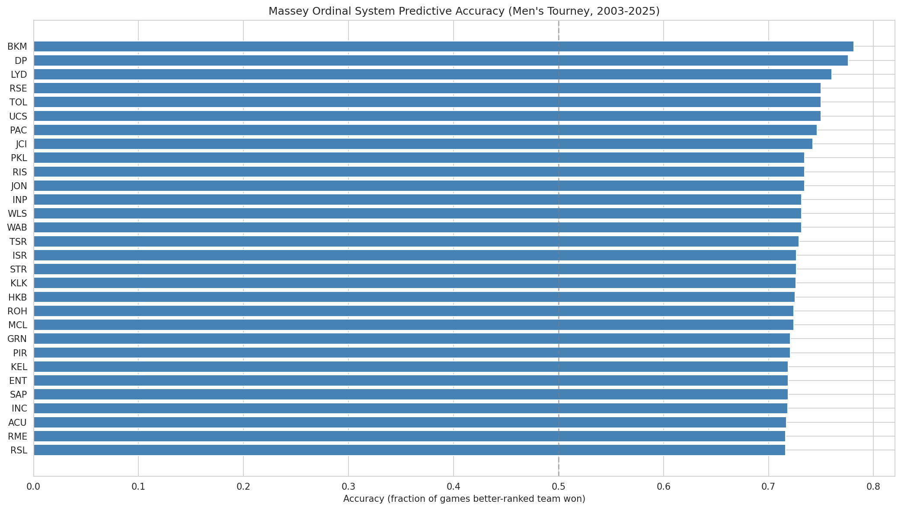
*Figure 4: Top 30 ranking systems by tournament prediction accuracy (Men's, 2003-2025). The best individual systems reach ~78% accuracy.*

### What Separates Tournament Teams from Everyone Else?

Tournament teams differ dramatically from non-tournament teams across key metrics.

| Statistic | Non-Tournament | Tournament | Difference |
|-----------|---------------|------------|------------|
| Win Pct | 0.442 | 0.726 | +64.3% |
| Avg Point Diff | -2.04 | +7.86 | +9.89 pts |
| Offensive Efficiency | 1.005 | 1.087 | +8.3% |
| Defensive Efficiency | 1.034 | 0.973 | -5.9% |
| FG% | 0.432 | 0.459 | +6.3% |
| Assists/Game | 12.74 | 14.48 | +13.7% |
| Blocks/Game | 3.18 | 3.84 | +20.7% |

*Table 3: Average statistics for tournament vs non-tournament teams (Men's, 2003+).*

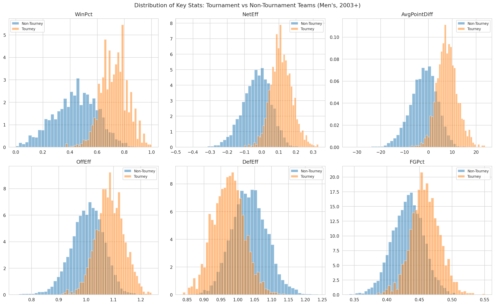
*Figure 5: Distribution of key statistics for tournament vs non-tournament teams (Men's, 2003+).*

### Which Statistics Best Predict Deep Tournament Runs?

Among teams that make the tournament, which stats predict who goes furthest? Seed is the strongest predictor, but point differential, net efficiency, and expert rankings all add meaningful signal.

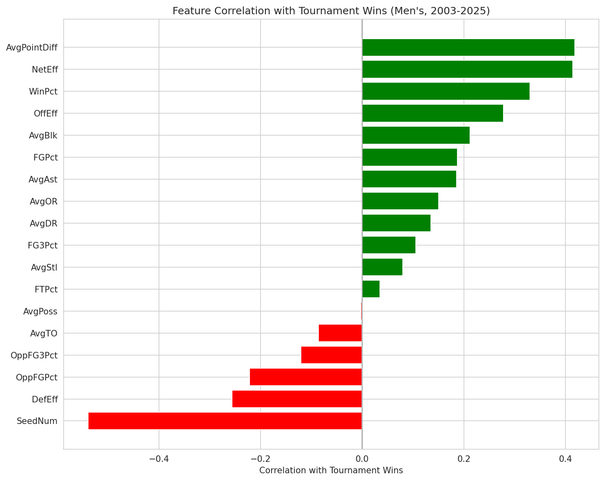
*Figure 6: How strongly each statistic correlates with tournament wins (Men's, 2003-2025). Seed has the strongest relationship, followed by point differential and net efficiency.*

### Do the Selection Committee's Seeds Match the Analytics?

Seeds and analytical rankings generally agree, but there's meaningful disagreement — especially for seeds 5-12. When the committee and the analytics disagree, that's exactly where the models can find an edge.

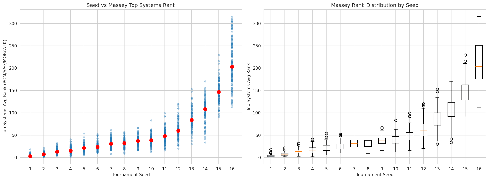
*Figure 7: Tournament seed vs analytical ranking (Men's, 2003-2025). The wide spread within each seed — especially in the middle — means there's predictive signal beyond seed alone.*

### Which Statistics Overlap?

Many basketball statistics measure similar things. Win percentage, point differential, and net efficiency are almost interchangeable (r > 0.94). The models need to handle this redundancy to avoid double-counting the same information.

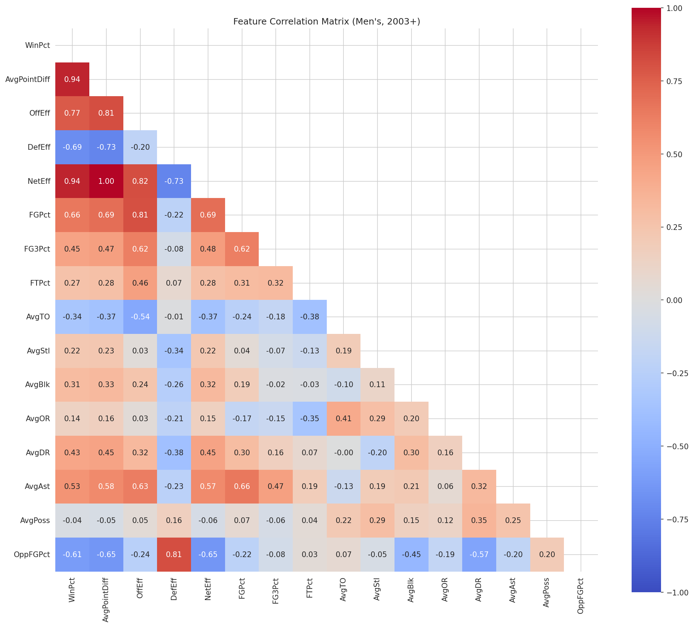
*Figure 8: How correlated the features are with each other (Men's, 2003+). Dark blue = nearly identical information. The models use regularization to handle this overlap.*

## What the Models See

For every potential matchup, the models don't see raw team stats — they see the **difference** between the two teams. For example, instead of "Duke shoots 48% and Oregon shoots 44%," the model sees "+4% shooting difference." This directly captures how two teams compare. The men's models use 74 of these difference features:

| Category | Features | Count | Missing Rate |
|----------|----------|-------|-------------|
| Seeds | SeedDiff, SeedA, SeedB | 3 | 0% |
| Massey Rankings | TopSystemsAvgRankDiff, AvgOrdinalRankDiff, POMDiff, SAGDiff, MORDiff, WLKDiff | 6 | 30% |
| Efficiency | OffEffDiff, DefEffDiff, NetEffDiff | 3 | 44% |
| Record & Momentum | WinPctDiff, WeightedWinPctDiff, WinStreakDiff, LossStreakDiff, AvgPointDiffDiff | 5 | 0-44% |
| Shooting | FGPctDiff, FG3PctDiff, FTPctDiff, OppFGPctDiff, OppFG3PctDiff | 5 | 44% |
| Advanced Shooting | eFGPctDiff, TSPctDiff, FTrDiff, ThreePArDiff, OppeFGPctDiff, OppTSPctDiff | 6 | 44% |
| Box Score Margins | FGM/FGA/FGM3/FTM/FTA/OR/DR/DRB_Pct/TotalReb/TO/Stl/Blk/Ast MarginDiff | 13 | 44% |
| Pace | AvgPossDiff | 1 | 44% |
| Conference & Elo | IsPowerConfDiff, ConfTourneyChampDiff, ConfRegSeasonChampDiff, EloDiff | 4 | 0% |
| Schedule Strength | SOSDiff, PowerConfWinPctDiff, QualityWinPctDiff, ScoreStdDiff, Top25/10/5WinPctDiff | 7 | 0% |
| Home/Road Splits | HomeWinPctDiff, RoadWinPctDiff, Home/RoadTop25/10/5WinPctDiff | 8 | 0% |
| Recent Form | RecentWinPctDiff, RecentAvgPointDiffDiff, RecentOff/Def/NetEffDiff, RecentFGPctDiff | 6 | 29% |
| Interaction | Seed_x_Rank (SeedDiff x TopSystemsAvgRankDiff) | 1 | 0% |
| Box Score Stats | AvgTO/Stl/Blk/OR/DR/Ast Diff, DRB_PctDiff | 7 | 44% |

*Table 4: Complete feature set for men's predictions (74 features). Missing rates reflect pre-2003 seasons lacking detailed box scores.*

## Model Results

### Optimized Settings

Each model has different settings that control how it learns. These were automatically optimized through 30-50 trials of testing different configurations:

| Parameter | XGBoost | PyTorch | Logistic Regression |
|-----------|---------|---------|---------------------|
| Architecture | max_depth=2 | BrierNet(64 -> 32 -> 1) | Linear |
| Learning rate | 0.136 | 0.00989 (Adam) | - |
| Regularization | alpha=0.017, lambda=0.071 | dropout=0.120, weight_decay=0.00392 | C=0.00839 (elasticnet, l1_ratio=0.909) |
| Loss function | Custom Brier | Brier (MSE) | Log loss |

*Table 6: Tuned hyperparameters for men's models.*

### How Each Model Performed

The "All Historical" column shows accuracy across every past tournament (1985-2025). "Kaggle Validation" shows accuracy on just 2022-2025 — the 4 seasons Kaggle uses to rank competitors before the real 2026 tournament. Lower Brier score = better predictions.

| Rank | Model | All Historical (Brier) | After Calibration | Kaggle Validation (Brier) |
|------|-------|----------------------|-------------------|--------------------------|
| 1 | PyTorch Neural Network | 0.1794 | **0.1760** | 0.1833 |
| 2 | XGBoost | 0.1812 | 0.1777 | 0.1813 |
| 3 | Logistic Regression | 0.1846 | 0.1817 | 0.1900 |

*Table 7: Men's model comparison. The neural network was the most accurate, and calibration improved every model.*

### What Did the Models Rely on Most?

| Feature | What It Measures | Importance |
|---------|-----------------|------------|
| SeedDiff | Difference in tournament seeding | 67.94 |
| TopSystemsAvgRankDiff | Difference in expert analytical rankings | 39.16 |
| EloDiff | Difference in Elo rating (overall team strength) | 23.80 |
| Seed_x_Rank | Interaction: seed combined with ranking | 16.06 |
| FGM_MarginDiff | Difference in field goal margin vs opponents | 9.12 |
| IsPowerConfDiff | Whether teams are from major conferences | 8.25 |

*Table 8: The features XGBoost relied on most (Men's). Seed difference dominates, but expert rankings and Elo ratings add significant value.*

### Final Blend

The optimizer determined how much to trust each model, weighting recent seasons more heavily since modern basketball is most relevant to 2026. The neural network gets the most weight, XGBoost adds complementary signal, and logistic regression was dropped entirely because it wasn't adding anything the other two didn't already capture.

| Model | Weight in Blend |
|-------|----------------|
| PyTorch Neural Network | **55.1%** |
| XGBoost | 44.9% |
| Logistic Regression | 0% |

| Approach | Brier Score |
|----------|-------------|
| Best single model (PyTorch) | 0.1760 |
| Equal-weight blend | 0.1762 |
| **Optimized blend** | **0.1747** |
| Improvement over best single | **-0.0013** |
| **Kaggle validation (2022-2025)** | **0.1800** |

*Table 9: Men's blend weights and final Brier scores. Weights were optimized with recency weighting — recent seasons count more.*

### Model Evaluation

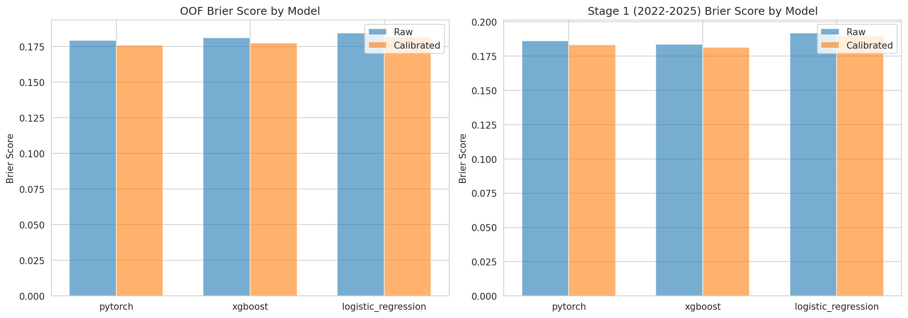
*Side-by-side accuracy comparison across all men's models and blends. Lower bars = better predictions.*

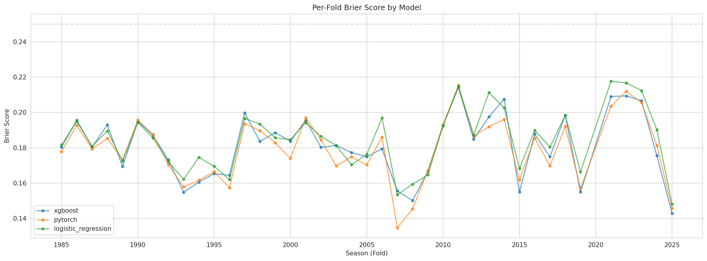
*How each model performed on each individual season (Men's). Some seasons had more upsets and were harder for all models.*

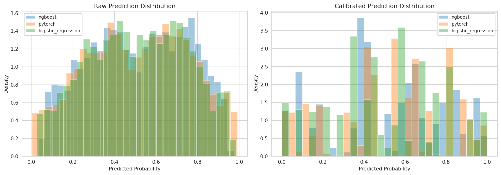
*Distribution of predicted probabilities for each men's model. A good model should produce a wide range — not cluster everything near 50%.*

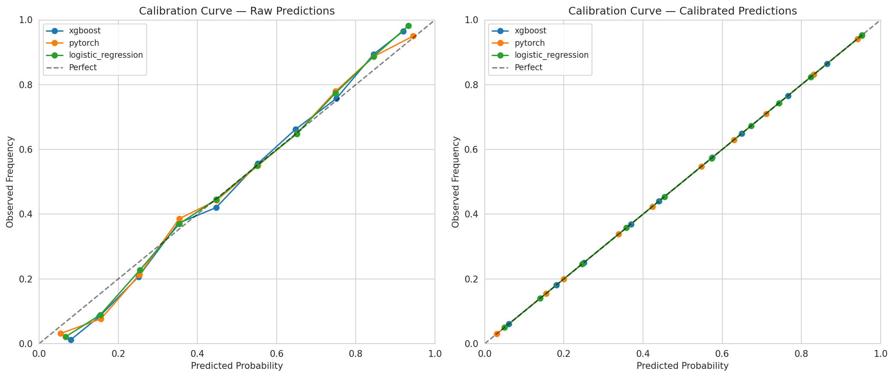
*Calibration curves (Men's). If a model says "70% chance," does that team actually win about 70% of the time? The closer to the diagonal, the better.*

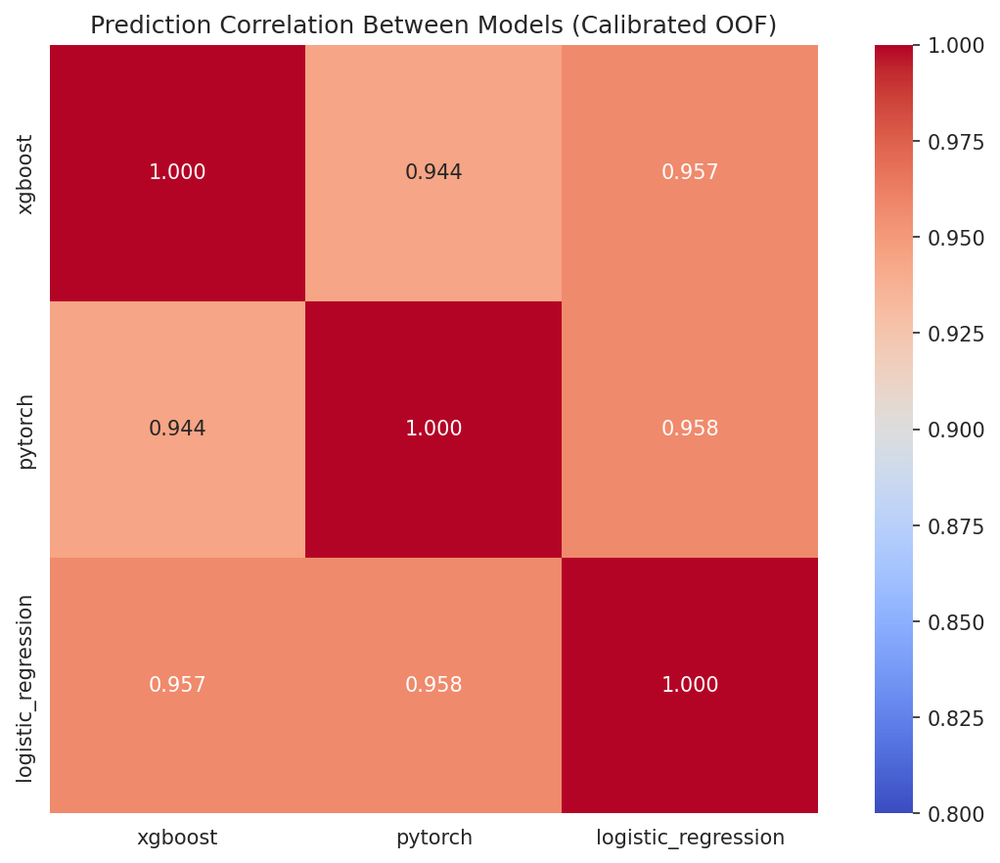
*Prediction correlation between men's models. High similarity is why logistic regression got 0% weight — it wasn't adding a unique perspective.*

---

# Part 2: Women's Tournament

## Data

The women's dataset spans 28 seasons (1998-2026) with 1,717 tournament games. The biggest challenge: **no expert ranking systems are available** for women's basketball (unlike the 192 systems available for men's). To compensate, I built a synthetic ranking by training a separate model to estimate team quality from other available statistics.

| Aspect | Men's | Women's |
|--------|-------|---------|
| Compact results start | 1985 | 1998 |
| Detailed box scores start | 2003 | 2010 |
| Massey Ordinals | 192 systems available | Not available (synthetic via Ridge, R²=0.423) |
| Number of features | 74 | 63 |
| Ensemble models | XGBoost + PyTorch + LogReg | CatBoost + PyTorch + LogReg |
| LOGO-CV folds | 40 | 27 |

*Table 11: Key differences between men's and women's pipelines.*

## Exploratory Data Analysis

### Seed Analysis

The women's tournament is significantly more predictable than the men's — upsets happen only 21% of the time vs 27% in men's. Top seeds dominate more consistently, which means the models can be more confident in their predictions.

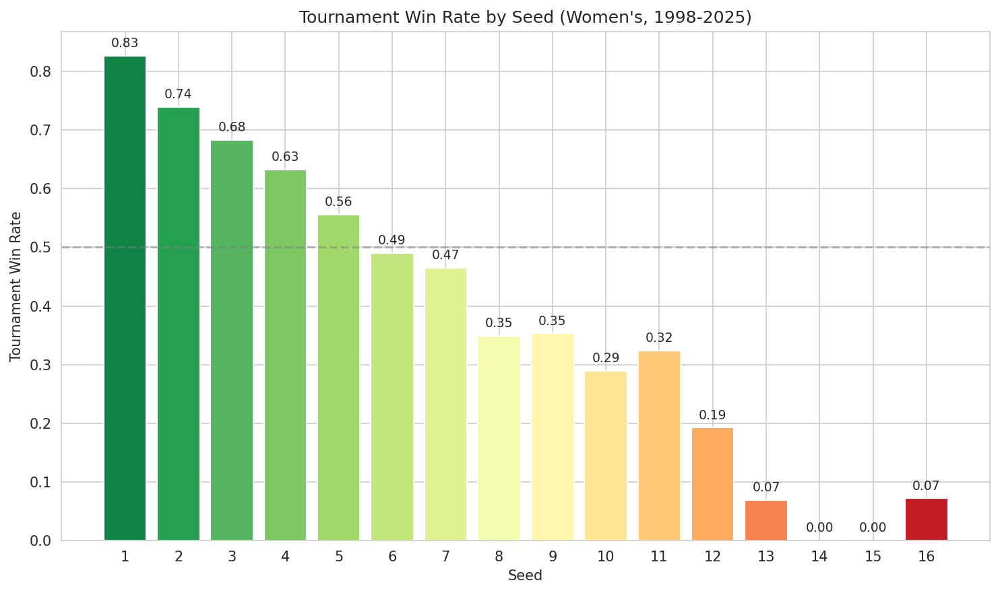
*Figure 9: Tournament win rate by seed number (Women's, 1998-2025). 1-seeds and 2-seeds are even more dominant than in the men's tournament.*

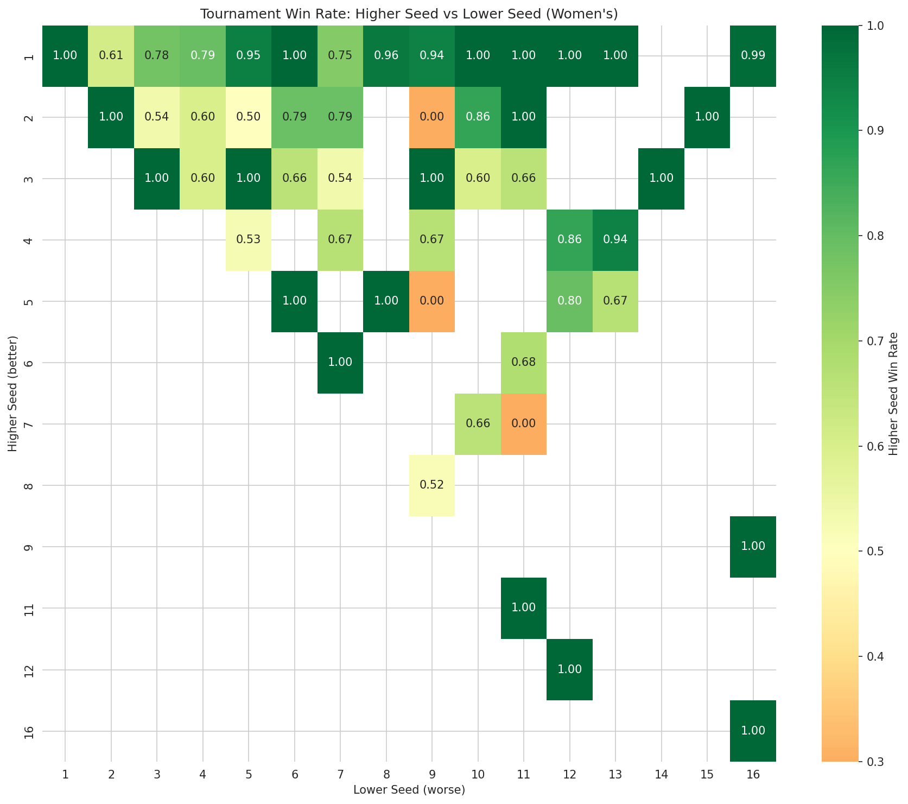
*Figure 10: Tournament win rate heatmap for seed matchups (Women's). More extreme probabilities, reflecting fewer upsets.*

### Upset Trends

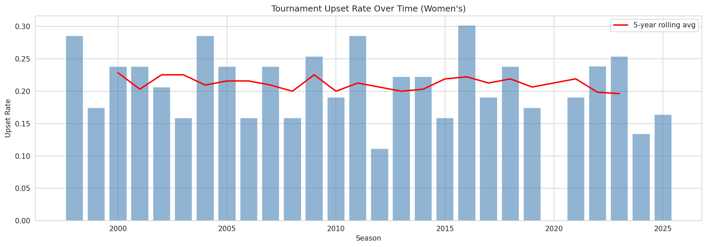
*Figure 11: Tournament upset rate by season (Women's, 1998-2025). Generally lower than men's with considerable year-to-year variance.*

### Feature Analysis

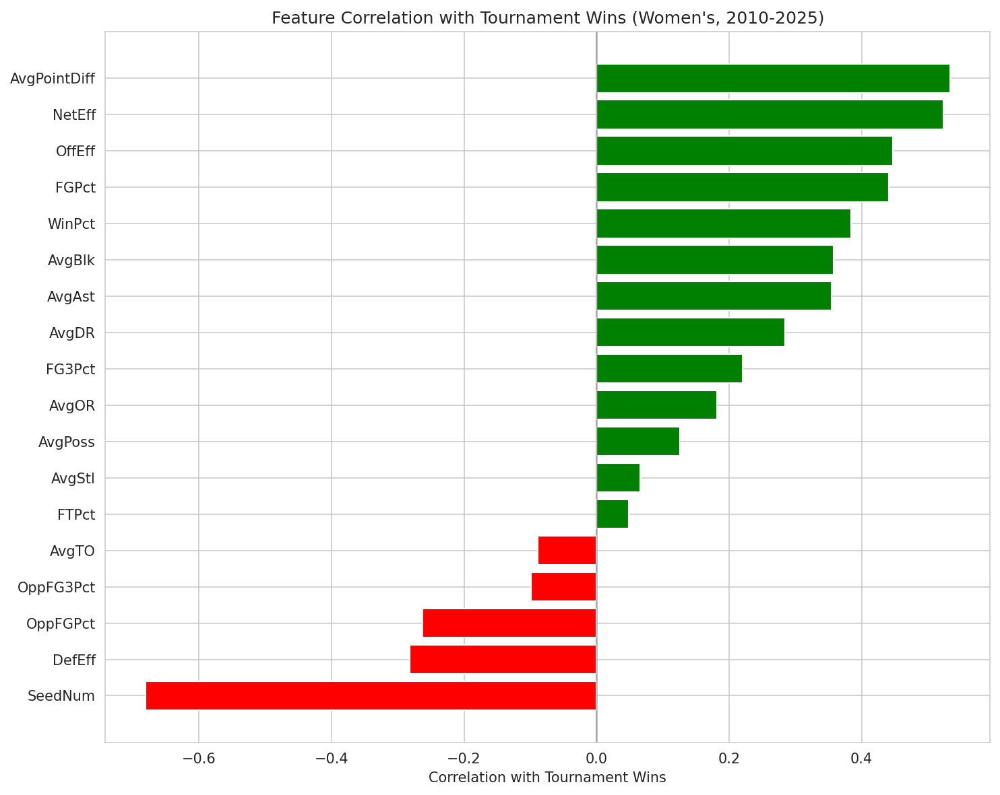
*Figure 12: Correlation of each feature with tournament wins (Women's). Without Massey Ordinals, seed number and efficiency stats carry the predictive load.*

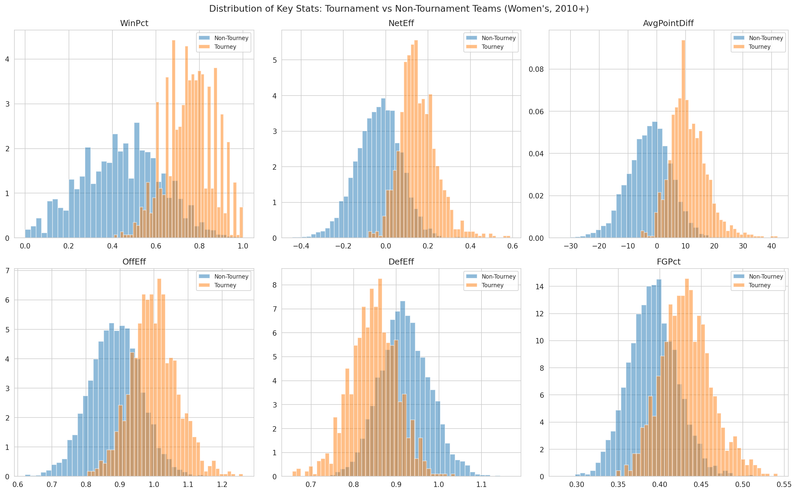
*Figure 13: Distribution of key statistics for tournament vs non-tournament teams (Women's, 2010+).*

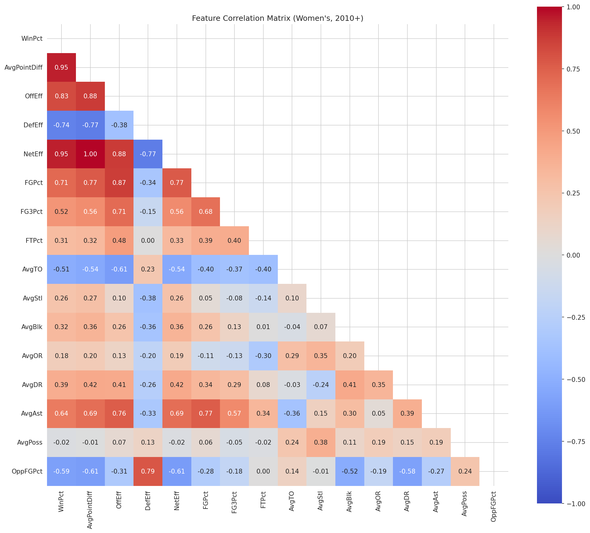
*Figure 14: Feature correlation matrix (Women's, 2010+). Similar multicollinearity patterns as men's.*

## What the Models See

The women's models use 63 difference features — fewer than men's because the 6 expert ranking features are replaced by a single synthetic ranking (since no expert ranking systems exist for women's basketball):

| Category | Features | Count |
|----------|----------|-------|
| Seeds | SeedDiff, SeedA, SeedB | 3 |
| Synthetic Rankings | SyntheticRankDiff | 1 |
| Efficiency | OffEffDiff, DefEffDiff, NetEffDiff | 3 |
| Record & Momentum | WinPctDiff, WeightedWinPctDiff, WinStreakDiff, LossStreakDiff, AvgPointDiffDiff | 5 |
| Shooting | FGPctDiff, FG3PctDiff, FTPctDiff, OppFGPctDiff, OppFG3PctDiff | 5 |
| Advanced Shooting | eFGPctDiff, TSPctDiff, FTrDiff, ThreePArDiff, OppeFGPctDiff, OppTSPctDiff | 6 |
| Box Score Margins | FGM/FGA/FGM3/FTM/FTA/OR/DR/DRB_Pct/TotalReb/TO/Stl/Blk/Ast MarginDiff | 13 |
| Pace | AvgPossDiff | 1 |
| Conference & Elo | IsPowerConfDiff, ConfTourneyChampDiff, ConfRegSeasonChampDiff, EloDiff | 4 |
| Schedule Strength | SOSDiff, PowerConfWinPctDiff, QualityWinPctDiff, ScoreStdDiff, Top25/10/5WinPctDiff | 7 |
| Home/Road Splits | HomeWinPctDiff, RoadWinPctDiff | 2 |
| Recent Form | RecentWinPctDiff, RecentAvgPointDiffDiff, RecentOff/Def/NetEffDiff, RecentFGPctDiff | 6 |
| Box Score Stats | AvgTO/Stl/Blk/OR/DR/Ast Diff, DRB_PctDiff | 7 |
| Interaction | Seed_x_Rank (SeedDiff x SyntheticRankDiff) | 1 |

*Table 12: Women's feature set (63 features).*

## Model Results

The women's pipeline uses CatBoost instead of XGBoost because ~44% of the training data (pre-2010 seasons) is missing detailed box score statistics, and CatBoost handles missing data gracefully without requiring manual workarounds.

### Optimized Settings

| Parameter | CatBoost | PyTorch | Logistic Regression |
|-----------|----------|---------|---------------------|
| Architecture | depth=7 | BrierNet(256 -> 128 -> 1) | Linear |
| Learning rate | 0.291 | 0.00639 (Adam) | - |
| Regularization | l2_leaf_reg=0.366, random_strength=9.390 | dropout=0.358, weight_decay=2.97e-6 | C=0.01491 (elasticnet, l1_ratio=0.624) |
| Loss function | RMSE | Brier (MSE) | Log loss |

*Table 13: Tuned hyperparameters for women's models.*

### How Each Model Performed

Women's Brier scores are much lower than men's (~0.13 vs ~0.18) because the women's tournament has fewer upsets, making it easier to predict.

| Rank | Model | All Historical (Brier) | After Calibration | Kaggle Validation (Brier) |
|------|-------|----------------------|-------------------|--------------------------|
| 1 | PyTorch Neural Network | 0.1353 | **0.1313** | 0.1303 |
| 2 | CatBoost | 0.1421 | 0.1378 | 0.1287 |
| 3 | Logistic Regression | 0.1415 | 0.1379 | 0.1358 |

*Table 14: Women's model comparison. The neural network again leads after calibration.*

### Final Blend

The neural network dominates even more in the women's blend (67%) compared to men's (55%). Again, logistic regression was dropped entirely.

| Model | Weight in Blend |
|-------|----------------|
| PyTorch Neural Network | **66.8%** |
| CatBoost | 33.2% |
| Logistic Regression | 0% |

| Approach | Brier Score |
|----------|-------------|
| Best single model (PyTorch) | 0.1313 |
| Equal-weight blend | 0.1315 |
| **Optimized blend** | **0.1299** |
| Improvement over best single | **-0.0014** |
| **Kaggle validation (2022-2025)** | **0.1244** |

*Table 15: Women's blend weights and final Brier scores.*

---

### Model Evaluation

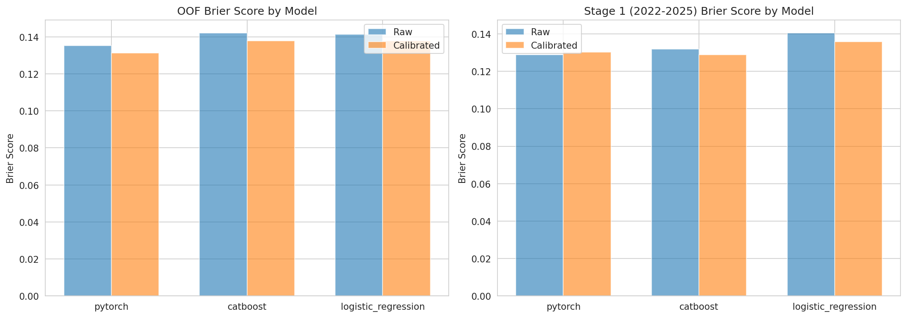
*Side-by-side accuracy comparison across all women's models and blends. Lower bars = better predictions.*

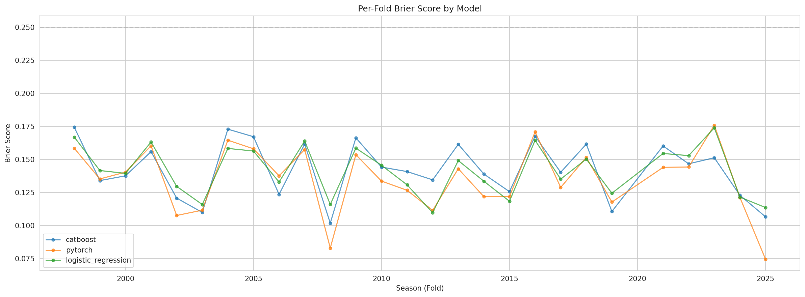
*How each model performed on each individual season (Women's). Some seasons had more upsets and were harder for all models.*

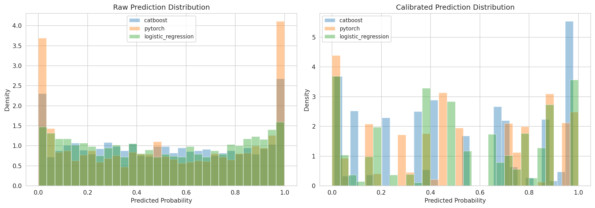
*Distribution of predicted probabilities for each women's model. A good model should produce a wide range — not cluster everything near 50%.*

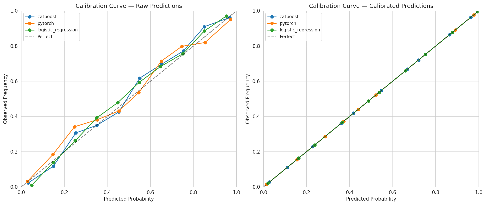
*Calibration curves (Women's). If a model says "70% chance," does that team actually win about 70% of the time? The closer to the diagonal, the better.*

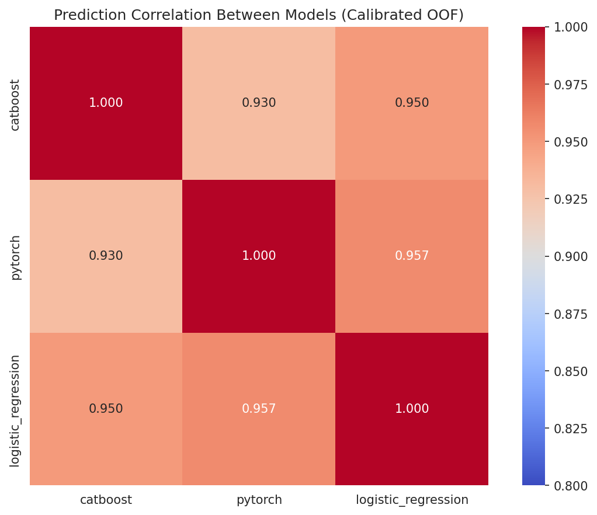
*Prediction correlation between women's models. High similarity is why logistic regression got 0% weight — it wasn't adding a unique perspective.*

---

# How Good Are These Predictions?

To put the scores in context: a coin flip scores 0.250, and just picking the better seed gets you to about 0.210-0.230. My models significantly outperform both baselines.

| Approach | Brier Score |
|----------|-------------|
| Coin flip (predict 50/50 for everything) | ~0.250 |
| Just pick the better seed | ~0.210-0.230 |
| **My men's blend (all historical)** | **0.1747** |
| **My men's blend (Kaggle validation)** | **0.1800** |
| **My women's blend (all historical)** | **0.1299** |
| **My women's blend (Kaggle validation)** | **0.1244** |

Lower is better. My models are substantially more accurate than simple seed-based predictions.

---

# Key Takeaways

## What Worked Best

1. **Training the neural network to directly optimize the scoring metric** was the single most impactful decision. Instead of using a generic loss function, the PyTorch model learned to minimize the exact Brier score it would be graded on — and it outperformed every other model.

2. **Using 74 features instead of just seeds** added real value. Shooting efficiency, momentum, strength of schedule, and expert rankings all contributed beyond what seed alone could capture.

3. **Automated setting optimization** (Optuna) found better configurations than manual tuning could, improving every model.

4. **Expert rankings** (men's only) were the second most important input after seed, providing a strong analytical complement to the committee's seedings.

5. **Probability calibration** — a simple post-processing step that corrects systematic biases in the predicted probabilities — improved every model.

6. **Data augmentation** — showing the model each matchup from both sides (Duke vs Oregon and Oregon vs Duke) — doubled the training data and prevented the model from learning spurious patterns based on team ordering.

7. **Tailoring the approach per gender** — using CatBoost (which handles missing data natively) for women's instead of XGBoost made a meaningful difference given the sparser historical data.

## Women's vs Men's: Key Differences

- The women's tournament is ~26% more predictable (Brier 0.130 vs 0.175) — top seeds dominate more consistently
- The neural network is even more dominant in the women's blend (67% vs 55%) because fewer expert inputs are available
- Without expert ranking systems, the women's pipeline relies on a synthetic ranking built from game statistics — useful but weaker than the 192 real ranking systems available for men's
- The women's neural network uses a larger architecture (256→128 neurons vs 64→32) — likely compensating for the missing ranking data by learning more complex patterns

---

# Technical Details

## Infrastructure

- **Execution**: AWS SageMaker notebook instances (Python 3.12)
- **Storage**: S3 bucket `s3://march-machine-learning-mania-2026/`
- **Libraries**: pandas, numpy, scikit-learn, matplotlib, seaborn, XGBoost, CatBoost, PyTorch, Optuna

## How to Reproduce

1. Place raw Kaggle data in `s3://march-machine-learning-mania-2026/00_data_collection/`
2. Run notebooks in order: `01_data_joining` -> `02_eda` -> `03_data_split` -> `04_preprocessing` -> `05_models` (all 3) -> `06_model_eval` -> `07_submission`
3. Run men's notebooks first, then women's at each stage
4. Model notebooks within a stage can run in any order (or in parallel)
5. To update for a new season: re-run the full pipeline once Kaggle updates the data

## Project Structure

```
march_machine_learning_mania_2026/
├── 00_data_collection/             Raw Kaggle CSVs
├── 01_data_joining/                Merge & aggregate datasets
│   ├── mens_notebook.ipynb
│   └── womens_notebook.ipynb
├── 02_eda/                         Exploratory analysis
│   ├── mens_notebook.ipynb
│   ├── womens_notebook.ipynb
│   └── output/                     Plots (Figures 1-14)
├── 03_data_split/                  Matchups + CV folds
├── 04_preprocessing/               Feature engineering
├── 05_models/
│   ├── xgboost/                    XGBoost (men's only)
│   ├── catboost/                   CatBoost (women's only)
│   ├── pytorch/                    PyTorch BrierNet (both ensembles)
│   └── logistic_regression/        Logistic Regression (both ensembles)
├── 06_model_eval/                  Model comparison + ensemble
│   ├── mens_notebook.ipynb
│   ├── womens_notebook.ipynb
│   └── output/                     Evaluation plots
├── 07_submission/                  Final CSV generation
├── RESEARCH.md                     Past winning strategy analysis
```
